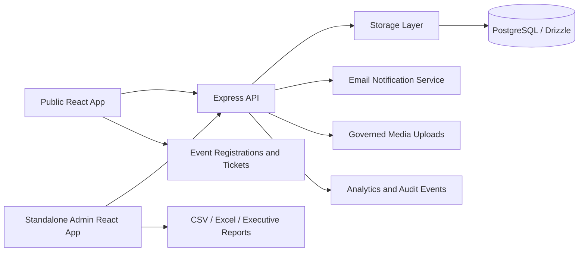
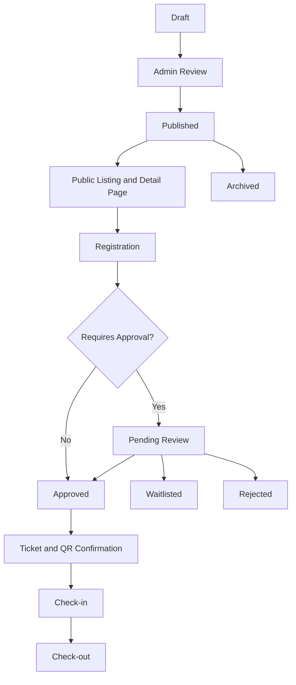
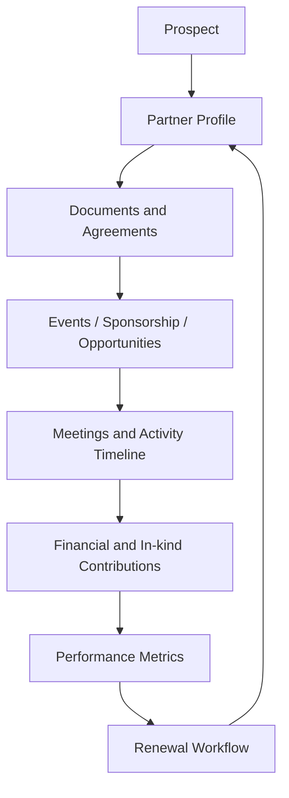

# Events and Partners Management Platform

## Executive Summary

The Admin Management Platform now includes enterprise-grade modules for Events Management and Partners Management. The modules centralize public content publishing, admin operations, registration workflows, partner CRM data, sponsorship tracking, documents, reporting, and future AI-ready automation hooks.

Primary audiences:

- NGOs and education consultancies managing events, sponsors, stakeholders, and public programs.
- Universities and scholarship programs managing registrations, applicants, partners, and documents.
- Conferences, innovation hubs, government projects, and enterprise teams managing events and collaborations.

Primary deliverables:

- Admin Events Control Center with event lifecycle, registration review, check-in/out, analytics, exports, and reporting.
- Admin Partners CRM workspace with profiles, tiers, communications, documents, renewals, contribution tracking, and analytics.
- Public events listing, detail pages, registration pages, ticket-aware forms, galleries, attachments, partners, and related events.
- Public partners showcase and partnership opportunities page.
- Production-grade schemas, migrations, validation, API workflows, security controls, and documentation.

## System Architecture



Key application areas:

- `client/src/pages/events.tsx`: public events listing, search, filters, recommendations, registration triggers.
- `client/src/pages/event-detail.tsx`: event detail, speakers, agenda, tickets, partners, gallery, attachments, maps, comments.
- `client/src/components/event-registration-dialog.tsx`: ticket-aware, custom-field registration flow.
- `client/src/pages/partners.tsx`: public partner showcase.
- `client/src/pages/partnership-opportunities.tsx`: collaboration and sponsor entry point.
- `Admin/client/src/pages/admin/events.tsx`: enterprise event administration.
- `Admin/client/src/pages/admin/partners.tsx`: partner CRM administration.
- `server/routes.ts`: REST APIs, validation, workflow automation, notifications, exports, reporting.
- `shared/schema.ts`: normalized production schemas.
- `migrations/0007_events_partners_enterprise.sql`: root platform database migration.
- `Admin/migrations/0001_enterprise_partner_events.sql`: standalone Admin database compatibility migration.

## Database Design

The root schema extends existing platform tables and adds normalized operational tables.

### Core Events

`events`

- Identity: `id`, `title`, `slug`, `summary`, `description`, `category`, `eventType`.
- Publishing: `status`, `isFeatured`, `isRecommended`, `isTrending`, `allowComments`.
- Venue: `location`, `venueName`, `address`, `mapUrl`, `isVirtual`, `virtualUrl`, `livestreamUrl`.
- Registration: `rsvpEnabled`, `requiresApproval`, `capacity`, `registrationDeadline`.
- Commercial: `isPaid`, `priceAmount`, `currency`, `ticketTypes`.
- Content: `organizer`, `coverImage`, `videoUrl`, `tags`, `customFields`, `agenda`, `speakers`, `sponsors`, `partners`, `faqs`, `resources`, `attachments`, `gallery`.
- Metadata: `seoMeta`, `socialMeta`, `viewCount`, `shareCount`, `likeCount`.

`event_registrations`

- Attendee: `fullName`, `email`, `phone`, `organization`, `userId`.
- Workflow: `status`, `attendanceStatus`, `approvalNotes`, `checkedInAt`, `checkedOutAt`.
- Ticketing: `ticketCode`, `ticketType`, `qrPayload`.
- Data capture: `answers`, `source`, `reminderOptIn`.

Additional normalized tables:

- `event_ticket_types`
- `event_media_assets`
- `event_documents`
- `event_notification_plans`

### Core Partners

`partners`

- Identity: `name`, `description`, `logoUrl`, `coverImage`.
- Contact: `contactName`, `contactEmail`, `contactPhone`, `website`, `socialLinks`.
- Classification: `industryCategory`, `partnershipLevel`, `sponsorshipTier`, `status`.
- Geography: `country`, `region`, `address`.
- Governance: `documents`, `agreements`, `notes`, `internalComments`.
- Links: `linkedEvents`, `linkedSponsorships`, `linkedOpportunities`, `partnershipHistory`.
- Legacy/public fields: `studentCount`, `ranking`, `programs`, `isActive`.

Additional normalized partner tables:

- `partner_activities`: communication, meetings, follow-ups, reminders.
- `partner_documents`: contracts, agreements, brochures, certificates, and access metadata.
- `sponsorships`: sponsorship commitments and linked events.
- `partner_opportunities`: pipeline records.
- `partner_financial_records`: pledged, invoiced, received, cancelled contributions.

### Platform Operations

Additional cross-cutting tables:

- `permissions`: RBAC-ready permission registry.
- `notifications`: user/admin notification center.
- `webhook_subscriptions`: outbound integration configuration.
- `webhook_deliveries`: webhook audit and retry history.

## API Documentation

All admin endpoints require authentication and admin/editor authorization. Public endpoints expose only published/active records.

### Public Events

- `GET /api/events`
  - Returns published public events with runtime status, registration counts, related public metadata, and media fields.
- `GET /api/events/:idOrSlug`
  - Returns a single public event by ID or slug.
- `POST /api/events/:id/view`
  - Tracks traffic analytics.
- `POST /api/events/:id/share`
  - Tracks share analytics.
- `POST /api/events/:id/like`
  - Tracks engagement.
- `POST /api/events/:id/comments`
  - Adds public discussion comments when enabled.
- `POST /api/events/:id/registrations`
  - Creates a registration, ticket code, QR payload, optional waitlist/approval status, and confirmation email.

Registration payload:

```json
{
  "fullName": "Jane Doe",
  "email": "jane@example.com",
  "phone": "+265...",
  "organization": "Example University",
  "ticketType": "standard",
  "source": "public_event_page",
  "answers": {
    "country": "Malawi",
    "notes": "Dietary requirements"
  },
  "reminderOptIn": true
}
```

### Admin Events

- `GET /api/admin/events?page=&limit=&search=&status=`
- `POST /api/admin/events`
- `PUT /api/admin/events/:id`
- `DELETE /api/admin/events/:id`
- `POST /api/admin/events/:id/duplicate`
- `PATCH /api/admin/events/:id/status`
- `GET /api/admin/events/analytics`
- `GET /api/admin/events/reports/summary`
- `GET /api/admin/events/:id/registrations`
- `GET /api/admin/events/:id/registrations/export?format=csv|excel`
- `PUT /api/admin/event-registrations/:id`
- `POST /api/admin/event-registrations/:id/check-in`
- `POST /api/admin/event-registrations/:id/check-out`

Admin event payload supports:

- Title, slug, rich content, category, tags.
- Organizer, venue, maps, virtual/physical mode.
- Dates, registration deadline, capacity.
- RSVP, approval, ticketing, pricing, currency.
- Speakers, sponsors, partners, agenda, attachments, gallery.
- SEO and social metadata.
- Public status and feature toggles.

### Public Partners

- `GET /api/partners`
- `GET /api/partners/:id`

Public records include profile information, logo, cover, website, country/region, partnership type, tier/level, videos, and showcase flags.

### Admin Partners

- `GET /api/admin/partners?page=&limit=&search=`
- `POST /api/admin/partners`
- `PUT /api/admin/partners/:id`
- `DELETE /api/admin/partners/:id`
- `GET /api/admin/partners/analytics/summary`
- `GET /api/admin/partners/:id/crm`
- `POST /api/admin/partners/:id/activities`
- `POST /api/admin/partners/:id/documents`
- `POST /api/admin/partners/:id/financial-records`

Partner activity payload:

```json
{
  "type": "meeting",
  "subject": "Renewal planning call",
  "notes": "Discussed sponsorship renewal and event visibility.",
  "dueAt": "2026-06-10T09:00:00.000Z",
  "owner": "Admin"
}
```

Partner document payload:

```json
{
  "title": "Gold Sponsorship Agreement",
  "type": "agreement",
  "url": "partners/contracts/gold-agreement.pdf",
  "version": 1,
  "accessLevel": "admin",
  "expiresAt": "2026-12-31T00:00:00.000Z"
}
```

Financial record payload:

```json
{
  "type": "contribution",
  "amount": 1500000,
  "currency": "MWK",
  "status": "pledged",
  "notes": "Gold sponsor pledge for annual summit."
}
```

## Authentication and Authorization

Authentication:

- JWT/session-aware admin requests.
- `authFetch` and `apiRequest` attach admin bearer tokens.
- Public event and partner reads do not expose internal comments, private documents, or CRM records.

Authorization:

- Admin routes require admin portal access.
- Event and partner operational endpoints require editor/admin permissions.
- Admin navigation is integrated with role-route configuration in `Admin/client/src/lib/admin-rbac.ts`.
- Future permission registry is supported by the `permissions` table.

Recommended production roles:

- `viewer`: read dashboards and public content status.
- `editor`: manage events, partners, registrations, documents, and exports.
- `admin`: manage users, roles, settings, audit logs, and all content.
- `super_admin`: platform owner with deployment, integration, and security privileges.

## Security Architecture

Implemented controls:

- Input validation with Zod schemas for event, registration, partner CRM, document, financial, and admin settings payloads.
- SQL injection prevention through Drizzle query builders and parameterized operations.
- XSS reduction through server-side escaping in generated ticket HTML and rich-text governance boundaries.
- Admin API protection through authentication and role checks.
- Upload governance through module-based media management.
- Ticket code and QR payload generation for check-in verification.
- Audit/analytics event logging for admin operations and public engagement.
- Registration approval and waitlist status controls.

Production hardening checklist:

- Enforce HTTPS and secure cookies.
- Enable CSRF protection for cookie-based admin sessions.
- Add WAF/rate limits to public registration/comment endpoints.
- Validate file MIME type, size, and extension at upload boundaries.
- Store private contracts outside public static directories.
- Use object storage with signed URLs for restricted documents.
- Add structured logging redaction for emails, tokens, and private notes.
- Run database backups and retention policies.

## Event Workflows

### Event Lifecycle



Admin capabilities:

- Create, edit, duplicate, publish/unpublish, archive, and delete events.
- Configure advanced event metadata, ticket types, custom registration fields, and media.
- Review and update attendee registration status.
- Check attendees in/out.
- Export registrations to CSV or Excel-compatible files.
- Download reporting summaries.

Public capabilities:

- Search and filter events.
- View event detail pages with speaker, sponsor, partner, agenda, gallery, attachment, and venue data.
- Register with dynamic fields and ticket type selection.
- Download/open ticket confirmation.
- Save, share, like, and comment where enabled.

## Partner Workflows



Admin capabilities:

- Manage partner identity, contact, region, type, level, tier, status, notes, and public visibility.
- Log communication, meetings, outcomes, and reminders.
- Track agreements, contracts, versioning, expiry, and access level.
- Track financial contributions, sponsorship status, and performance metrics.
- Monitor renewal alerts and sponsorship tier distribution.

Public capabilities:

- Browse partner showcase.
- Search by organization, country, category, website, or video.
- View partner detail pages.
- Visit partnership opportunities page and contact partnership team.

## Notifications and Communications

Implemented email workflows:

- Event registration confirmation.
- Event registration status update.
- Partner onboarding email.

Designed extension points:

- Event reminder emails.
- Scheduled event update notices.
- Partner renewal alerts.
- SMS-ready notification payloads.
- WhatsApp-ready integration adapter.
- Webhook subscription and delivery records.

## Reporting and Analytics

Events dashboards include:

- Total events.
- Published, live, and upcoming events.
- Registrations and approved registrations.
- Views, shares, and conversion rate.
- Category distribution.
- Top events.
- Attendance and revenue in report summaries.
- Geographic participation by registration answers.

Partners dashboards include:

- Total, active, featured, and premium partners.
- Total tracked contribution value.
- Sponsorship tier distribution.
- Renewal alerts from expiring agreements.
- CRM activity, documents, and financial history.

## UI/UX Documentation

Design principles:

- Admin surfaces are operational, dense, and scan-friendly.
- Public surfaces are content-rich, responsive, and conversion-oriented.
- Cards are reserved for repeated items and framed tools.
- Search, filters, tabs, tables, exports, and inline actions are used for operational speed.
- Dialog forms use grouped tabs to reduce cognitive load.

Component patterns:

- `DataTable`: searchable, paginated, selectable enterprise tables.
- `Tabs`: profile/relationship/document/visibility form grouping.
- `MediaAssetPicker`: governed upload and selection for logos, covers, and event media.
- `Badge`: statuses, tiers, runtime indicators, and public labels.
- `RichTextEditor`: long-form partner/event content.
- Recharts: dashboards and reporting visuals.

Accessibility standards:

- Buttons expose text or accessible labels.
- Forms use labels, structured controls, and visible errors.
- Tables include predictable column headers and row actions.
- Color is paired with text for statuses.
- Responsive grids collapse to single-column mobile layouts.

Dark/light mode:

- Admin UI is built with tokenized Tailwind classes and theme-aware variables.
- Public app currently forces light mode for brand consistency in `client/src/App.tsx`.
- Admin-side dark mode can be enabled through the existing theme token system.

## File and Document Management

Supported:

- Module-based media assets for partners and events.
- Logo/cover image upload and governed asset references.
- Event gallery, attachments, and public downloads.
- Partner documents and agreements with version, access level, and expiry metadata.

Recommended production storage:

- Store public media in CDN-backed object storage.
- Store private contracts in restricted buckets.
- Use signed URLs for private previews/downloads.
- Generate thumbnails and optimized responsive variants.
- Retain original media metadata for audit and reuse.

## AI-Ready and Automation Architecture

The system is prepared for AI features through structured data:

- `tags`, `seoMeta`, `socialMeta`, `customFields`, `answers`, `agenda`, `speakers`, `partners`, and `partnershipHistory`.
- Partner CRM activity timeline and financial records for predictive renewal scoring.
- Analytics records for automated reporting and engagement prediction.
- Webhook tables for external automation integrations.

Future AI-ready workflows:

- Smart event recommendations.
- Semantic partner matching.
- Auto-generated event reports.
- Renewal risk prediction.
- Sponsor visibility scoring.
- Smart search over events, partners, agreements, and registration answers.

## Deployment Process

Recommended process:

1. Install dependencies with Node 20+.
2. Configure environment variables for database, admin URL, public URL, email provider, and JWT/session secrets.
3. Apply migrations:
   - `migrations/0007_events_partners_enterprise.sql`
   - `Admin/migrations/0001_enterprise_partner_events.sql`
4. Run type checks:
   - `npm run check`
   - `npm run check --prefix ./Admin`
5. Build apps:
   - `npm run build:client`
   - `npm run build:admin`
6. Deploy API and static assets.
7. Verify admin routes, public event pages, registration, partner pages, exports, and email logs.

## CI/CD Strategy

Recommended pipeline stages:

- Install and cache dependencies.
- Type check root and Admin projects.
- Lint and format checks if enabled.
- Run unit/integration tests for API validation and workflows.
- Build public and admin bundles.
- Run smoke tests against a preview deployment.
- Apply migrations with controlled rollout.
- Promote to production after health checks.

## Performance Optimization

Implemented/ready:

- Paginated admin list endpoints.
- Search filtering and status filtering.
- Lazy media rendering on public pages.
- Lightweight JSON payloads for public partner/event reads.
- Separate report endpoints for expensive analytics.

Recommended:

- Add database indexes for event status/date/category and partner status/tier.
- Cache public event and partner lists at CDN edge.
- Queue large exports and email batches.
- Move reporting aggregation into materialized views for high-volume installations.

## Backup and Recovery Strategy

Recommended:

- Daily full PostgreSQL backups.
- Point-in-time recovery for production databases.
- Separate backup policy for media/object storage.
- Weekly restore drills.
- Export critical partner agreements and event registration reports before major migrations.

## Monitoring and Troubleshooting

Monitor:

- API error rates and latency.
- Registration creation failures.
- Email delivery failures.
- Upload validation failures.
- Export/report generation duration.
- Admin authentication failures.
- Database migration status.

Troubleshooting:

- If registrations fail, inspect event capacity, deadline, `requiresApproval`, and server validation logs.
- If ticket links fail, verify `PUBLIC_APP_URL` and route availability.
- If partner CRM records do not show, refetch `/api/admin/partners/:id/crm` and verify meta persistence.
- If media does not render, verify governed asset references and upload module path.
- If exports are empty, confirm selected event has registration records.

## Maintenance and Upgrade Procedures

- Keep schema migrations additive where possible.
- Maintain backward compatibility with existing public partner and event fields.
- Use admin meta fields as compatibility layer during incremental migrations.
- Validate new custom registration fields before publishing.
- Review expiring partner agreements weekly.
- Archive completed events and inactive partners to keep admin lists operational.

