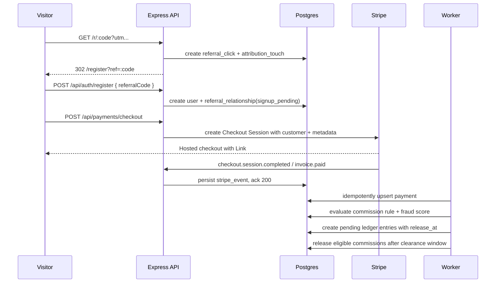

# Referral and Payment Infrastructure Architecture

Status: production design blueprint  
Target stack: Vite/React client, Express API, Drizzle ORM, Postgres/Neon, Stripe Checkout, Link by Stripe, optional Stripe Connect

## Executive Architecture

The platform should treat referrals as a revenue-attributed growth engine, not an invite table. The current `referrals` table is retained only as a compatibility facade; the production system is built around immutable funnel events, campaign rules, risk scoring, Stripe revenue events, and a double-entry ledger.

Core services:

- Client app: referral dashboard, share links, attribution capture, checkout entry, wallet balance, payout requests.
- Admin app: campaign boosts, commission rules, disputes, risk review, payout approval, referral CAC/LTV analytics.
- Express API: public referral redirect/click tracking, authenticated dashboard APIs, Stripe checkout session creation, webhook ingest, ledger worker.
- Postgres: transactional source of truth for users, attribution, payments, commissions, wallet ledger, payouts, audit events.
- Worker/queue: webhook processing, delayed commission release, fraud review, payout batching, analytics rollups.
- Stripe: Checkout Sessions, Customers, PaymentIntents, Subscriptions/Billing, webhooks, Link-enabled accelerated checkout, optional Connect for user payouts.

Stripe design notes:

- Use Stripe Checkout for card and mobile-friendly checkout; Link is available on Stripe Checkout/Payment Links when enabled in Stripe settings.
- Webhooks are the payment truth, not the redirect success page.
- Persist Stripe event IDs and process asynchronously to survive retries and spikes.
- Use Stripe idempotency keys for all server-side `POST` calls that create Stripe objects.
- Use Stripe Connect only when the business is ready for regulated marketplace-style payouts; otherwise maintain internal balances and pay manually/export batches.

Official references:

- Stripe webhooks: https://docs.stripe.com/webhooks
- Stripe payment event handling: https://docs.stripe.com/webhooks/handling-payment-events
- Stripe subscriptions with Checkout: https://docs.stripe.com/payments/subscriptions
- Stripe idempotency: https://docs.stripe.com/api/idempotent_requests
- Stripe Connect payouts: https://docs.stripe.com/connect/payouts-connected-accounts

## Event Flow



## Database Schema

Use integer minor units for money. Use ISO-4217 currency codes. Financial tables are append-only except status fields.

### Growth Tables

```sql
ALTER TABLE users
  ADD COLUMN referral_code varchar(24) UNIQUE,
  ADD COLUMN stripe_customer_id text UNIQUE,
  ADD COLUMN default_currency varchar(3) DEFAULT 'USD';

CREATE TABLE referral_campaigns (
  id serial PRIMARY KEY,
  name text NOT NULL,
  code_prefix varchar(20),
  starts_at timestamp NOT NULL,
  ends_at timestamp,
  status varchar(30) NOT NULL DEFAULT 'draft',
  boost_bps integer NOT NULL DEFAULT 10000,
  max_rewards_per_referrer integer,
  attribution_model varchar(30) NOT NULL DEFAULT 'last_click',
  created_by integer NOT NULL,
  created_at timestamp DEFAULT now()
);

CREATE TABLE referral_codes (
  id serial PRIMARY KEY,
  user_id integer NOT NULL REFERENCES users(id),
  campaign_id integer REFERENCES referral_campaigns(id),
  code varchar(32) NOT NULL UNIQUE,
  expires_at timestamp,
  max_uses integer,
  use_count integer NOT NULL DEFAULT 0,
  status varchar(30) NOT NULL DEFAULT 'active',
  created_at timestamp DEFAULT now()
);

CREATE TABLE referral_clicks (
  id bigserial PRIMARY KEY,
  referral_code_id integer REFERENCES referral_codes(id),
  campaign_id integer REFERENCES referral_campaigns(id),
  referrer_id integer REFERENCES users(id),
  visitor_id uuid NOT NULL,
  ip_hash text,
  user_agent_hash text,
  device_fingerprint_hash text,
  landing_url text,
  utm jsonb,
  risk_score integer NOT NULL DEFAULT 0,
  created_at timestamp DEFAULT now()
);

CREATE TABLE referral_relationships (
  id serial PRIMARY KEY,
  referrer_id integer NOT NULL REFERENCES users(id),
  referred_user_id integer NOT NULL UNIQUE REFERENCES users(id),
  referral_code_id integer REFERENCES referral_codes(id),
  campaign_id integer REFERENCES referral_campaigns(id),
  level integer NOT NULL DEFAULT 1,
  attribution_model varchar(30) NOT NULL,
  status varchar(40) NOT NULL DEFAULT 'signup_pending',
  fraud_status varchar(40) NOT NULL DEFAULT 'clear',
  first_payment_id integer,
  activated_at timestamp,
  created_at timestamp DEFAULT now(),
  updated_at timestamp DEFAULT now(),
  CONSTRAINT no_self_referral CHECK (referrer_id <> referred_user_id)
);
```

### Payment and Ledger Tables

```sql
CREATE TABLE payments (
  id serial PRIMARY KEY,
  user_id integer NOT NULL REFERENCES users(id),
  stripe_customer_id text,
  stripe_checkout_session_id text UNIQUE,
  stripe_payment_intent_id text UNIQUE,
  stripe_invoice_id text UNIQUE,
  stripe_subscription_id text,
  amount_total integer NOT NULL,
  amount_net integer,
  currency varchar(3) NOT NULL,
  status varchar(40) NOT NULL,
  product_type varchar(60) NOT NULL,
  metadata jsonb,
  paid_at timestamp,
  refunded_at timestamp,
  created_at timestamp DEFAULT now()
);

CREATE TABLE commission_rules (
  id serial PRIMARY KEY,
  campaign_id integer REFERENCES referral_campaigns(id),
  product_type varchar(60),
  level integer NOT NULL DEFAULT 1,
  calculation_type varchar(30) NOT NULL, -- percent, flat, hybrid
  percent_bps integer NOT NULL DEFAULT 0,
  flat_amount integer NOT NULL DEFAULT 0,
  currency varchar(3) NOT NULL DEFAULT 'USD',
  release_delay_days integer NOT NULL DEFAULT 14,
  min_payment_amount integer DEFAULT 0,
  max_commission_amount integer,
  status varchar(30) NOT NULL DEFAULT 'active',
  created_at timestamp DEFAULT now()
);

CREATE TABLE commissions (
  id serial PRIMARY KEY,
  payment_id integer NOT NULL REFERENCES payments(id),
  referral_relationship_id integer NOT NULL REFERENCES referral_relationships(id),
  beneficiary_user_id integer NOT NULL REFERENCES users(id),
  rule_id integer REFERENCES commission_rules(id),
  level integer NOT NULL,
  gross_payment_amount integer NOT NULL,
  commission_amount integer NOT NULL,
  currency varchar(3) NOT NULL,
  status varchar(40) NOT NULL DEFAULT 'pending_release',
  release_at timestamp NOT NULL,
  released_at timestamp,
  reversed_at timestamp,
  risk_score integer NOT NULL DEFAULT 0,
  idempotency_key text NOT NULL UNIQUE,
  created_at timestamp DEFAULT now()
);

CREATE TABLE wallet_accounts (
  id serial PRIMARY KEY,
  user_id integer NOT NULL UNIQUE REFERENCES users(id),
  currency varchar(3) NOT NULL DEFAULT 'USD',
  available_balance integer NOT NULL DEFAULT 0,
  pending_balance integer NOT NULL DEFAULT 0,
  lifetime_earned integer NOT NULL DEFAULT 0,
  created_at timestamp DEFAULT now()
);

CREATE TABLE ledger_entries (
  id bigserial PRIMARY KEY,
  wallet_account_id integer REFERENCES wallet_accounts(id),
  user_id integer REFERENCES users(id),
  commission_id integer REFERENCES commissions(id),
  payout_request_id integer,
  direction varchar(10) NOT NULL, -- debit, credit
  balance_type varchar(20) NOT NULL, -- pending, available, paid_out, reversed
  amount integer NOT NULL,
  currency varchar(3) NOT NULL,
  entry_type varchar(60) NOT NULL,
  idempotency_key text NOT NULL UNIQUE,
  created_at timestamp DEFAULT now()
);

CREATE TABLE stripe_events (
  id serial PRIMARY KEY,
  stripe_event_id text NOT NULL UNIQUE,
  event_type text NOT NULL,
  object_id text NOT NULL,
  payload jsonb NOT NULL,
  processing_status varchar(30) NOT NULL DEFAULT 'received',
  processed_at timestamp,
  error text,
  created_at timestamp DEFAULT now()
);

CREATE TABLE payout_requests (
  id serial PRIMARY KEY,
  user_id integer NOT NULL REFERENCES users(id),
  amount integer NOT NULL,
  currency varchar(3) NOT NULL,
  method varchar(40) NOT NULL, -- stripe_connect, bank, mobile_money, manual
  destination jsonb,
  status varchar(40) NOT NULL DEFAULT 'requested',
  requested_at timestamp DEFAULT now(),
  approved_by integer,
  approved_at timestamp,
  paid_at timestamp,
  failure_reason text
);
```

### Risk, Disputes, and Audit

```sql
CREATE TABLE fraud_signals (
  id bigserial PRIMARY KEY,
  user_id integer REFERENCES users(id),
  referral_relationship_id integer REFERENCES referral_relationships(id),
  payment_id integer REFERENCES payments(id),
  signal_type varchar(80) NOT NULL,
  severity varchar(20) NOT NULL,
  score integer NOT NULL,
  metadata jsonb,
  created_at timestamp DEFAULT now()
);

CREATE TABLE referral_disputes (
  id serial PRIMARY KEY,
  referral_relationship_id integer REFERENCES referral_relationships(id),
  opened_by integer NOT NULL REFERENCES users(id),
  assigned_to integer REFERENCES users(id),
  status varchar(40) NOT NULL DEFAULT 'open',
  reason text NOT NULL,
  resolution text,
  created_at timestamp DEFAULT now(),
  resolved_at timestamp
);
```

Indexes:

- `referral_clicks(referral_code_id, created_at desc)`
- `referral_relationships(referrer_id, status, created_at desc)`
- `payments(user_id, status, paid_at desc)`
- `commissions(beneficiary_user_id, status, release_at)`
- `ledger_entries(user_id, created_at desc)`
- `stripe_events(processing_status, created_at)`
- hash indexes or btree indexes on `ip_hash`, `device_fingerprint_hash` if fraud queries are frequent.

## API Endpoints

### Public Growth

- `GET /r/:code`: validate code/campaign expiry, create click, set signed attribution cookie, redirect to register.
- `POST /api/referral/resolve`: returns sanitized campaign/referrer preview for a code.
- `POST /api/analytics/track`: tracks activation milestones with attribution context.

### Authenticated User

- `GET /api/referrals/me`: dashboard summary with clicks, signups, paid conversions, conversion rate, pending/available earnings, leaderboard rank.
- `POST /api/referrals/invites`: send or record an invite email without awarding value.
- `GET /api/referrals/ledger`: paginated commissions and ledger entries.
- `POST /api/payouts`: request withdrawal after threshold and KYC checks.
- `GET /api/payouts`: payout history.

### Payments

- `POST /api/payments/checkout`: create/reuse Stripe Customer, create Checkout Session with `mode=payment` or `subscription`, attach `user_id`, `product_type`, `referral_relationship_id`, and internal idempotency key in metadata.
- `GET /api/payments/:id`: payment status for confirmation UI.
- `POST /api/stripe/webhook`: verify signature, persist event, return `2xx`, enqueue processing.

### Admin

- `GET/POST/PUT /api/admin/referral-campaigns`
- `GET/POST/PUT /api/admin/commission-rules`
- `GET /api/admin/referrals`: full funnel, filters by campaign/status/risk.
- `POST /api/admin/referrals/:id/override`: approve, deny, reassign attribution, reverse commission.
- `GET /api/admin/fraud-signals`
- `POST /api/admin/payouts/:id/approve`
- `POST /api/admin/payouts/:id/reject`
- `GET /api/admin/revenue/referrals`: CAC, referred LTV, payback period, revenue leakage, pending liability.

## Commission Algorithm

Inputs: payment, referred user, relationship, campaign, commission rules, fraud score.

1. Ignore non-revenue events: failed, unpaid, refunded, trial-only, zero-value, test-mode mismatches.
2. Select attribution:
   - last-click: most recent valid click before signup within campaign window.
   - multi-touch: split weight across valid touches; only Level 1 earns by default.
3. Select rule by `campaign_id`, `product_type`, `level`, status, and payment amount.
4. Compute:
   - percent: `amount_net * percent_bps / 10000`
   - flat: `flat_amount`
   - hybrid: `flat_amount + percent component`
5. Apply campaign boost and caps.
6. Create commission with idempotency key:
   - `commission:{payment_id}:{relationship_id}:{level}:{rule_id}`
7. Create pending ledger credit and pending platform liability.
8. Release after `release_delay_days` only if payment is settled, no refund/dispute, and risk is below threshold.
9. On refund/dispute, reverse unreleased commissions or debit available balance before future payout.

Default rule recommendation:

- Signup: no cash, only gamified progress.
- First paid application/plan: Level 1 gets 10-15% of net revenue or a fixed acquisition bonus, whichever converts better in testing.
- Level 2: disabled at launch or capped at 2-3% to avoid MLM optics and unit-economics leakage.
- Release delay: 14-30 days, aligned to refund/dispute risk.
- Payout threshold: USD 25-50 equivalent.

## Fraud Detection Algorithm

Risk score starts at 0 and accumulates:

- Self-referral: +100 and block.
- Same IP hash for referrer and referred within 30 days: +30.
- Same device fingerprint hash: +70.
- Disposable email domain or plus-address cluster: +25.
- Many signups from one referrer with no payments: +20.
- Payment method reused across referred accounts: +80.
- Refund/dispute after commission accrual: +60 and freeze.
- Velocity spike above campaign baseline: +20 to +60.
- Mismatched geo, impossible travel, bot-like user agent: +10 to +40.

Actions:

- `0-39`: allow.
- `40-69`: hold reward, require delayed release and possible email/phone verification.
- `70-99`: manual review.
- `100+`: block commission and open dispute/audit record.

Privacy rule: store hashes/fingerprints, never raw card data, and keep user-facing terms explicit about anti-abuse checks.

## Reconciliation Model

Use the ledger as the source of truth for user earnings and Stripe as the source of truth for customer charges.

Daily jobs:

- Pull Stripe balance transactions for payments/refunds/fees.
- Match Stripe `payment_intent`, `invoice`, and `checkout_session` IDs to `payments`.
- Recalculate net revenue and compare with `amount_net`.
- Compare commission liability with wallet pending/available balances.
- Export payout batch and reconcile paid status.

Monthly finance outputs:

- Gross revenue, refunds, disputes, Stripe fees, net revenue.
- Referral commissions pending, released, reversed, paid.
- Referral CAC by campaign.
- LTV and retention of referred vs organic users.
- Liability aging report.

## UI/UX Wireframes

### Referral Dashboard

- Header row: referral link with copy/share buttons, campaign badge, expiry countdown.
- Metrics row: clicks, signups, paid conversions, conversion rate, pending earnings, available earnings.
- Funnel chart: click to signup to first payment to retained month two.
- Earnings table: referred user, source campaign, status, payment trigger, pending release date, amount.
- Leaderboard: weekly/monthly/all-time, segmented by campaign; hide suspicious or unverified users.
- Milestones: visual progress to next boost, but cash language must match terms.

### Checkout UI

- Use server-created Stripe Checkout Session.
- Keep pre-checkout page minimal: plan/application summary, price, currency, guarantee/refund language, security note.
- Redirect to Stripe Checkout where cards, mobile wallets, and Link handle low-friction payment.
- Success page says "Payment processing" until backend confirms webhook status.

### Admin Controls

- Campaign builder: date window, boost multiplier, code expiry, cap, attribution model.
- Rule builder: product type, level, flat/percent/hybrid, caps, release delay.
- Risk queue: explainable signals, approve/deny/reassign/release actions.
- Finance dashboard: pending liability, payout queue, refunds/disputes, reconciliation exceptions.

## Deployment and Reliability

- Add `STRIPE_SECRET_KEY`, `STRIPE_WEBHOOK_SECRET`, `STRIPE_DEFAULT_CURRENCY`, `PUBLIC_APP_URL`, and optional `STRIPE_CONNECT_CLIENT_ID`.
- Put webhook ingest behind HTTPS; preserve raw body for signature verification.
- Return `2xx` fast after persisting `stripe_events`; process business logic in a queue.
- Make every worker step idempotent with unique keys and database constraints.
- Use row-level transactions for payment-to-commission-to-ledger writes.
- Add rate limits on `/r/:code`, registration, checkout creation, and payout requests.
- Add structured audit logging for admin overrides and all financial mutations.
- Use read replicas/materialized views for dashboards; do not query raw click tables for every dashboard load at scale.
- Back up Postgres with point-in-time recovery; test restore and webhook replay.
- Monitor webhook failure rate, queue lag, commission release lag, payout aging, suspicious referral velocity, checkout conversion, refund rate, and referred-user LTV.

## Implementation Order

1. Add schema/migrations and backfill `users.referral_code`.
2. Replace hardcoded `USER123` dashboard links with `/r/:code`.
3. Capture referral code on register and create `referral_relationships`.
4. Add Stripe Checkout creation and webhook ingest.
5. Add idempotent payment processing and pending commission ledger writes.
6. Add delayed release worker and refund/dispute reversal worker.
7. Add user wallet dashboard and payout request flow.
8. Add admin campaign/rule/risk/payout surfaces.
9. Add reconciliation reports and finance exports.
10. Run A/B tests on flat vs percent rewards, campaign boost timing, and payout threshold.
